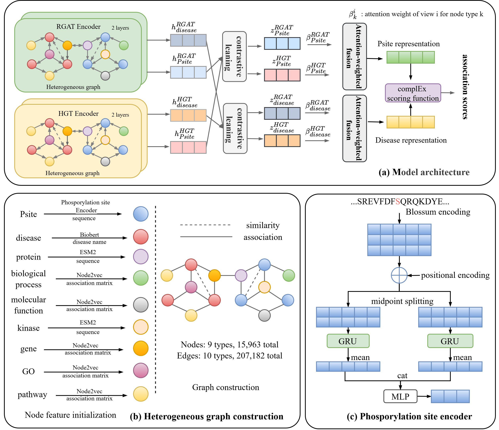

# CDVGL-PDA

## Contacts
Any more questions, please do not hesitate to contact me: 20245227066@stu.suda.edu.cn.

## Introduction
CDVGL-PDA is a contrastive dual-view graph learning framework for phosphorylation site-disease association prediction.

## Requirements
All experiments were run on Ubuntu 20.04.5 LTS with NVIDIA Tesla V100 (32GB) or Tesla A100 (40GB) GPUs, using NVIDIA driver 535.104.05.
- python 3.10.13
- pytorch 2.4.0
- numpy 2.0.1
- scikit-learn 1.6.1
- dgl  2.4.0.th24.cu121
- cuda 12.9
## Quick start

1. Unzip the zip files (psite_nw_identity_mat.zip in data/graph_feature, and psite_blosum_residue_embeddings_71_21.zip in data/node_feature) to the current folder.
2. cd src
3. train and test
- Train and test the model on low-similarity benchmarks. The script `1_main_hard.py` supports multiple dataset settings by modifying the input arguments of the `main_hard` function: `main_hard(prefix, train_txt, test_txt)`

```python

# Example Usage

# 1.To run the model on the psite-level dataset:
# First, modify the parameters in the script as follows:
# main_hard(prefix='1_psite_level', train_txt='psite_level_train_1', test_txt='psite_level_test_1')
# Then, execute the script:
python 1_main_hard.py

# 2.To run the model on the protein-level dataset:
# main_hard(prefix='2_protein_level', train_txt='protein_level_train_1', test_txt='protein_level_test_1')

# 3.To run the model on the pair-level dataset:
# main_hard(prefix='3_pair_level', train_txt='pair_level_train', test_txt='pair_level_test')
```
- Perform 10-fold cross-validation on benchmarks with different positive-to-negative ratios (including both balanced and imbalanced settings)
```
python 1_main_10fold.py
```


## Data description
***data/datasets***:
- 5_random: benchmarks with different positive-to-negative ratios
- 2_protein_level: a low-similarity benchmark based on protein-level split
- 1_psite_level: a low-similarity benchmark based on protein-level split
- 3_pair_level: a low-similarity benchmark based on pair-level split
- 4_disease_level: a low-similarity benchmark based on disease-level split

***data/graph_feature***: This folder contains node features for all nine node types in the heterogeneous graph.

***data/node_feature***: This folder contains edge information for all ten edge types in the heterogeneous graph.

***data/example***:This folder contains the input data used by the prediction scripts, which are provided as illustrative examples.

***data/Table S20_heterogeneous graph nodes.xlsx*** :This file records the nine types of nodes in the heterogeneous graph.

***data/Table S21_heterogeneous graph edges.xlsx*** :This file records the ten types of edges in the heterogeneous graph.

***data/Psite_Meshname_with_residue_withID.csv***: This file contains phosphorylation site–disease associations collected and curated from the PTMD2.0 and PhosphoSitePlus (PSP) databases.

## Directory Description

***src/tools***: This folder includes files used during model training and inference, such as heterogeneous graph construction code, and configuration files for training parameters.


